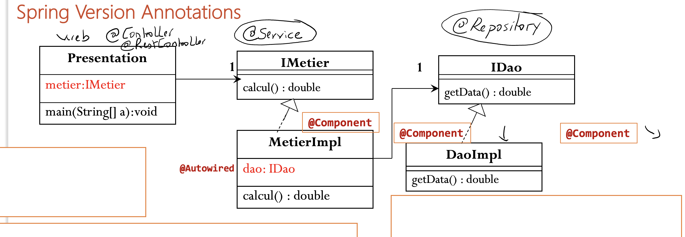
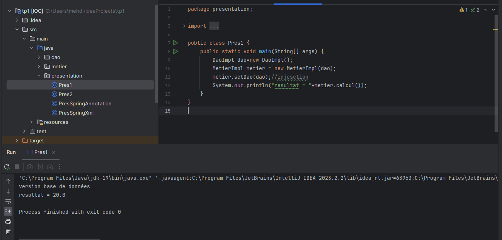
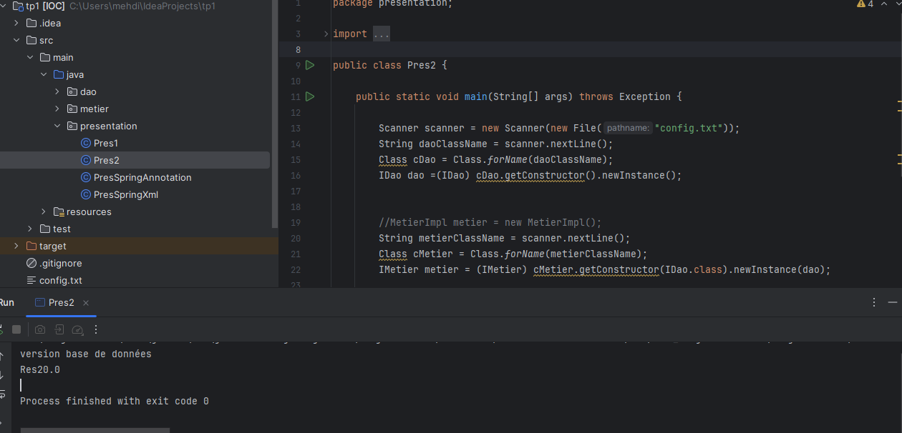
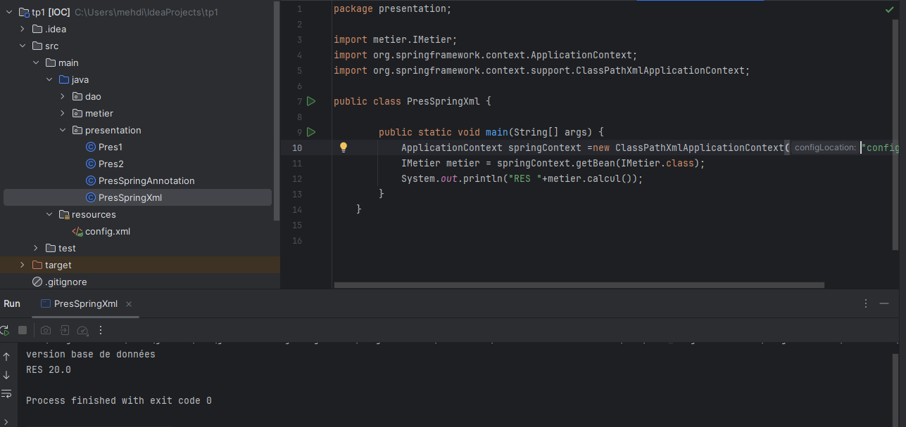
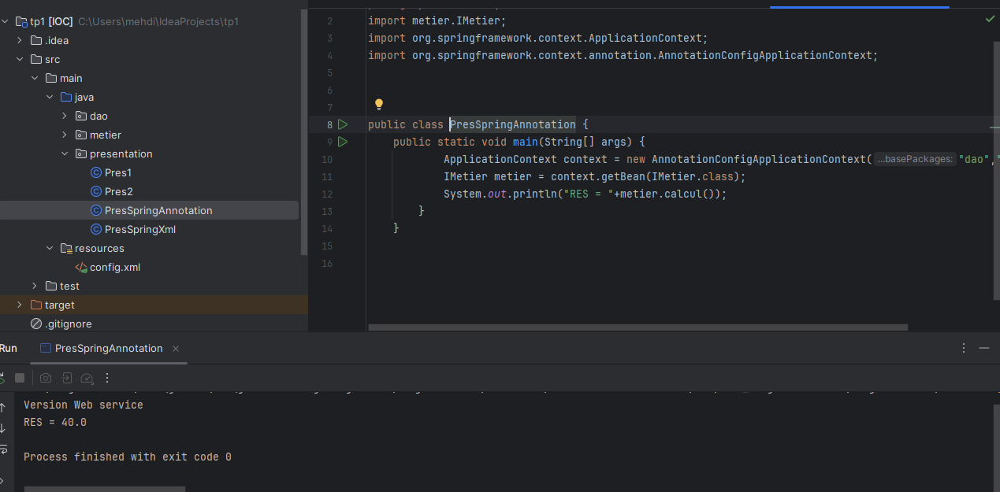

<h1>Rapport de l'inversion de contrôle et l'injection des dépendances</h1>
<h2>Introduction</h2>

L'inversion de contrôle (IoC) est un processus qui permet de spécifier les dépendances d'un objet sans nécessiter leur création directe. Avec IoC, la création des objets est gérée par un conteneur, tel que Spring, qui assure l'injection des beans en 
les reliant les uns aux autres de manière à satisfaire toutes leurs dépendances

Cela va aider le développeur la possibilité de se focaliser sur la partie Métier de l'application

Spring va s'occuper de l'injection des dépandences et toutes les fonctionnalités techniques

<h2>Ennoncé</h2>
<ol>
    <li>Couche DAO 
        <ul>
            <li>créer l'interface IDao</li>
            <li>créer une implémentation de l'interface IDao</li>
        </ul>
    </li>
    <li>Couche Métier
        <ul>
            <li>créer l'interface IMetier</li>
            <li>créer une implémentation de l'interface IMetier</li>
        </ul>
    </li>
    <li>Couche Présentation
        
Créer une application qui permet de faire l'injection des dépandences

        <ul>
        <li>Instantiation statique</li>
        <li>Instantiation dynamique</li>
        <li>En utilisant Spring Framework
            <ul>
                <li>version XML</li>
                <li>version Annotation</li>
            </ul>
        </li>
        </ul>
    </li>
</ol>
<h2>Conception</h2>
<h3>Principe du couplage faible</h3>

Pour utiliser le couplage faible, nous devons utiliser les interfaces.
Considérons une classe DaoImpl qui implémente l'interface IDao, et une classe MetierImpl qui implémente l'interface IMetier.

Si la classe MetierImpl est liée à l’interface IDao par une association, on dit que le classe MetierImpl et la classe IDaoImpl sont liées par un
couplage faible.

Cela signifie que la classe MetierImpl peut fonctionner avec n’importe quelle classe qui implémente l’interface IDao.
En effet la classe MetierImpl ne connait que l’interface IDao. De ce fait n’importe quelle classe implémentant cette
interface peut être associée à la classe MetierImpl, sans qu’il soit nécessaire de modifier quoi que se soit dans la
classe MetierImpl.

Avec le couplage faible, nous pourrons créer des applications fermées à la modification et ouvertes à
l’extension.

<h3>Presentation 1 Instantiation statique</h3>

<h3>Presentation 2 Instantiation dynamique version Base de Données</h3>

<h3>Presentation 2 Instantiation dynamique version web service</h3>

<h3>Presentation Spring XML</h3>

<h3>Presentation Spring Annotation</h3>

